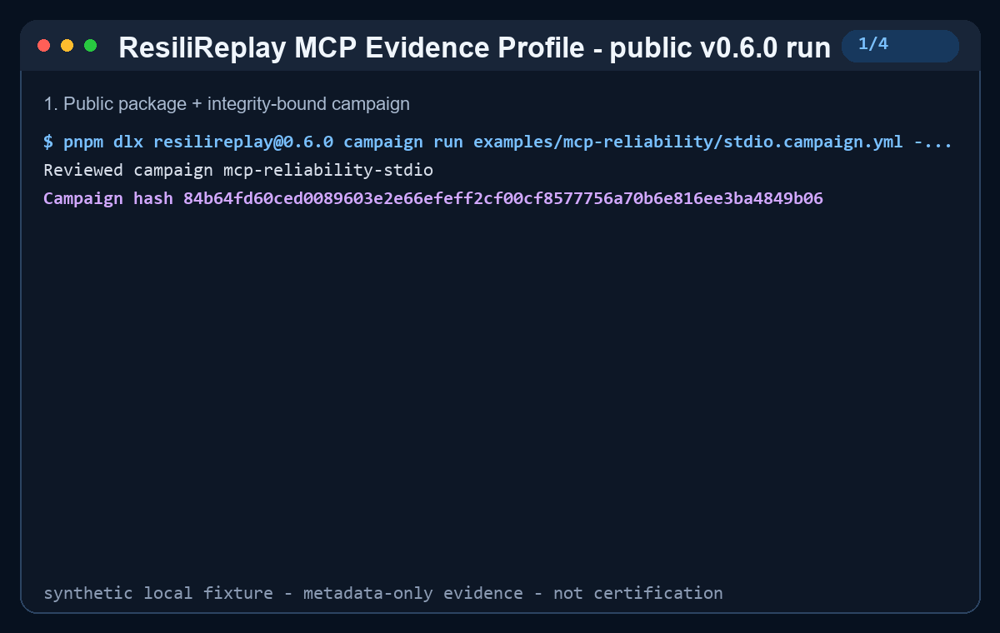

# ResiliReplay

[](https://github.com/aliengineering-byte/resilireplay/actions/workflows/ci.yml)
[](https://github.com/aliengineering-byte/resilireplay/actions/workflows/secret-scan.yml)
[](https://aliengineering-byte.github.io/resilireplay/)
[](https://www.npmjs.com/package/resilireplay)
[](https://github.com/aliengineering-byte/resilireplay/releases/tag/v0.6.0)
[](LICENSE)

**Turn a failed tool call from a supported coding agent into sanitized, deterministic, executable regression evidence.**

MCP Inspector shows what a server does. ResiliReplay proves what happens when it fails, whether it recovers safely, and whether that recovery stays fixed. It is a local-first reliability layer, not another agent, observability dashboard, LLM evaluator, sandbox, or security certification.

```console
npx --yes resilireplay@0.6.0 demo
npx --yes resilireplay@0.6.0 connect --agent auto --dry-run
npx --yes resilireplay@0.6.0 mcp serve
```

[](docs/assets/everywhere-demo.png)

[Static PNG](docs/assets/everywhere-demo.png) · [genuine transcript](docs/assets/everywhere-demo-transcript.txt) · [self-contained regression](examples/everywhere/everywhere.test.mjs) · [product site](https://aliengineering-byte.github.io/resilireplay/)

## ResiliReplay MCP Reliability Evidence Profile

This project-defined profile describes the minimum evidence for a bounded MCP reliability claim: pinned
identity and authority, a clean control, deterministic fault, expected-failure negative control,
bounded recovery, integrity hashes, executable regression when causal failure exists, and verified
cleanup. It is an open testing convention maintained by ResiliReplay—not an official MCP standard,
certification, security testing, or an endorsement.

[Read the evidence profile](docs/mcp-reliability/MCP_RELIABILITY_STANDARD.md) ·
[run the five-minute MCP test](docs/mcp-reliability/FIVE_MINUTE_MCP_TEST.md) ·
[compare seven executed profiles](docs/mcp-reliability/COMPATIBILITY_AND_RECOVERY_MATRIX.md) ·
[contribute a case](docs/mcp-reliability/CONTRIBUTING_CASES.md)

[](docs/mcp-reliability/DEMO.md)

[Static PNG](docs/assets/mcp-reliability-standard-demo.png) ·
[verified transcript](docs/assets/mcp-reliability-standard-demo-transcript.txt) ·
[campaign](examples/mcp-reliability/stdio.campaign.yml) ·
[generated regression](examples/mcp-reliability/generated-regression/README.md)

## Try it in under five minutes

Requirements: Node.js 22 or 24. Previewing is side-effect free; applying requires confirmation, backs up existing files, and leaves capture off.

```console
npx --yes resilireplay@0.6.0 connect --agent auto --dry-run
npx --yes resilireplay@0.6.0 connect --agent claude-code
npx --yes resilireplay@0.6.0 connect --agent codex
npx --yes resilireplay@0.6.0 connect --agent hermes

npx --yes resilireplay@0.6.0 capture start
# reproduce one safe supported tool failure in the agent
npx --yes resilireplay@0.6.0 capture last
npx --yes resilireplay@0.6.0 capture stop
npx --yes resilireplay@0.6.0 capture generate-test
```

`connect --dry-run` prints the exact repository-local file operations and hashes without writing files or starting a process. Apply preserves unrelated settings, installs the portable skill, and records a recoverable backup. Use `resilireplay connect --rollback` to restore the latest backup. Capture is opt-in and passive: hooks never inject a fault or retry a failed operation. Hermes intentionally stages reviewable repository files and prints the official `hermes mcp add` follow-up instead of silently editing the global Hermes profile.

The in-agent request is:

> Use ResiliReplay to capture this session’s tool failures, explain the recovery boundary, and turn the last supported failure into a regression test.

## What is genuinely supported?

The v0.6 framework layer separates runtime proof from protocol fixtures and documentation:

| Framework         | Version/profile | Evidence                  | Local boundary                                                          |
| ----------------- | --------------- | ------------------------- | ----------------------------------------------------------------------- |
| LangGraph         | 1.4.9           | `GENUINE_RUNTIME`         | Real graph, tool, retry, timeout, stream, checkpoint, and subgraph runs |
| OpenAI Agents SDK | 0.14.3          | `GENUINE_RUNTIME`         | Public SDK with a deterministic local/no-key model                      |
| AutoGen           | >=0.4 profile   | `FIXTURE_BACKED_PROTOCOL` | Compatible OTLP fixture through the neutral bridge                      |
| CrewAI            | >=0.100 profile | `DOCUMENTED_ONLY`         | Public event-listener mapping                                           |
| LlamaIndex        | >=0.12 profile  | `DOCUMENTED_ONLY`         | Public instrumentation mapping                                          |

```console
pnpm demo:frameworks
pnpm exec resilireplay adapter detect --package @langchain/langgraph
pnpm exec resilireplay adapter doctor openai-agents
```

See the [framework quick starts](docs/FRAMEWORKS.md) and [support policy](docs/product/FRAMEWORK_SUPPORT_POLICY.md).

Coding-agent and MCP surfaces inherited from v0.5 are re-gated in v0.6:

| Surface                                      | v0.6.0 evidence                          | Result                                                                                                                                                                  |
| -------------------------------------------- | ---------------------------------------- | ----------------------------------------------------------------------------------------------------------------------------------------------------------------------- |
| Claude Code 2.1.222                          | INSTALLATION VERIFIED + FIXTURE VERIFIED | Official manifest validation, isolated marketplace install, installed `PostToolUseFailure` runtime, and passing generated regression. No isolated model authentication. |
| OpenAI Codex CLI 0.146.1                     | INSTALLATION VERIFIED + FIXTURE VERIFIED | Isolated local-marketplace install, installed `PostToolUse` runtime, and passing generated regression. No isolated model authentication.                                |
| Hermes Agent 0.20.0                          | INSTALLATION VERIFIED                    | Portable local skill discovered; ResiliReplay stdio MCP registered, connected in 578 ms, and exposed nine tools. No safe local model was available.                     |
| MCP SDK/stdio                                | LIVE VERIFIED                            | Real SDK client discovery/calls and ResiliReplay self-audit pass without recursive tool execution.                                                                      |
| Generic adapter contract                     | FIXTURE VERIFIED                         | Golden output, privacy, bounds, entrypoint containment, and concurrent determinism pass.                                                                                |
| `.agents/skills` clients                     | DOCUMENTED ONLY                          | Portable package validates against the official Agent Skills reference, but no client-specific runtime claim is made.                                                   |
| Cursor, Gemini CLI, OpenCode, Goose, VS Code | DOCUMENTED ONLY                          | Candidate adapter surfaces only; not runtime-verified in v0.6.0.                                                                                                        |

Evidence labels are defined in the [compatibility matrix](docs/COMPATIBILITY.md). Vendor names describe factual interoperability and do not imply endorsement.

## Claude Code plugin

The repository is a Claude Code marketplace, so the public install path is:

```text
/plugin marketplace add aliengineering-byte/resilireplay
/plugin install resilireplay@resilireplay
```

The plugin contains `.claude-plugin/plugin.json`, stable `PostToolUse`, `PostToolUseFailure`, and `Stop` hooks, the portable skill, and the stdio MCP registration. The installed hook accepts stdin only, writes no stdout, validates `CLAUDE_PLUGIN_ROOT`, uses `CLAUDE_PLUGIN_DATA` only as vendor-owned writable state, and remains inert until capture is armed. See [plugin operations and rollback](docs/PLUGINS.md).

## Codex plugin

Codex discovers the repo marketplace at `.agents/plugins/marketplace.json`; the CLI test path is:

```console
codex plugin marketplace add aliengineering-byte/resilireplay
codex plugin add resilireplay@resilireplay
```

The plugin contains `.codex-plugin/plugin.json`, the same skill and MCP server, and a bundled `PostToolUse`/`Stop` hook runtime. It distinguishes non-zero shell results, MCP errors/success, file edits, interruptions, duplicates, oversized payloads, secret-shaped input, and unsupported hosted-tool fixtures without assuming every delivered event succeeded. `PLUGIN_ROOT` is immutable; `PLUGIN_DATA` is vendor-owned writable state. See [plugin trust boundaries](docs/PLUGINS.md).

## Universal ResiliReplay MCP server

```console
npx --yes resilireplay@0.6.0 mcp serve
```

The default transport is stdio. Nine annotated tools cover status/version, fault discovery, sanitized target inspection, campaign validation, passive capture start/stop, last-failure evidence, regression generation, and explicitly confirmed campaign execution. Read-only, destructive, idempotent, and open-world annotations are declared. Regression writes require the exact evidence SHA-256; campaign execution requires the exact reviewed campaign SHA-256 and retains the existing allowlists and remote-target boundary.

## Stable schemas and adapter contract

The canonical integration engine is `@resilireplay/agent`; vendor hooks are thin adapters. Public v1 schemas are:

- [`resilireplay.agent-event/v1`](schemas/agent-event.v1.schema.json)
- [`resilireplay.capture-session/v1`](schemas/capture-session.v1.schema.json)
- [`resilireplay.failure-evidence/v1`](schemas/failure-evidence.v1.schema.json)
- [`resilireplay.adapter-manifest/v1`](schemas/adapter-manifest.v1.schema.json)
- [`resilireplay.framework-event/v1`](schemas/framework-event-v1.schema.json)
- [`resilireplay.adapter-template/v1`](schemas/adapter-template-v1.schema.json)

Create and verify an adapter without changing the engine:

```console
npx --yes resilireplay@0.6.0 adapter init my-agent-adapter
npx --yes resilireplay@0.6.0 adapter verify ./my-agent-adapter
```

“ResiliReplay Compatible” means only that the published conformance suite passed. Read the [adapter contract](docs/ADAPTER_CONTRACT.md), [minimal adapter](examples/adapters/minimal/adapter.json), and [badge rules](docs/ADAPTER_CONTRACT.md#compatibility-badge).

## Existing v0.4 workflows remain supported

```console
resilireplay adopt --config ./mcp.json --dry-run
resilireplay studio --open
resilireplay campaign validate campaign.yml
resilireplay campaign run campaign.yml --confirm-tools <reviewed-sha256>
resilireplay campaign approve runs/candidate --output baselines/main.json
resilireplay campaign compare runs/current --baseline baselines/main.json
resilireplay record --output runs/agent/trace.jsonl -- node agent.js
resilireplay inject --trace runs/agent/trace.jsonl --scenario malformed-json --seed 42 --output runs/agent/failed.jsonl
resilireplay replay --trace runs/agent/failed.jsonl --report-dir runs/agent/report
resilireplay generate-test --trace runs/agent/failed.jsonl --output runs/agent/regression
resilireplay mcp audit --inspector-config ./mcp.json --server my-server --dry-run
```

Campaign exit codes remain `0` pass, `1` reliability failure/regression, `2` usage, `20` invalid schema, `21` target/authorization, `22` execution, `23` cancelled/incomplete, and `24` integrity failure. See the [v0.5 migration guide](docs/MIGRATION_V0_5.md), [campaign schema](docs/CAMPAIGN_SCHEMA.md), and [MCP Inspector integration](docs/MCP_INSPECTOR.md).

## Privacy, security, and measured bounds

- Capture is off by default. No telemetry, cloud account, billing, background upload, raw prompt, full transcript, environment value, authorization header, token, unrestricted tool body, or personal path is persisted by default.
- Session and tool-call identifiers are one-way SHA-256 projections. Bodies become hashes; summaries are redacted and capped at 512 characters.
- Capture is capped at 20,000 events and 32 KiB per normalized event. State and evidence use atomic replacement; the locked append-only journal repairs an interrupted trailing record.
- Hook writers are serialized, duplicate tool-call outcomes are ignored, symlink/junction escapes fail closed, and generated regressions refuse overwrite.
- Hooks never execute a target, retry a call, or inject a failure. Explicit campaigns retain their review, allowlist, hash confirmation, retry, and cleanup controls.

On the recorded Windows Node 24 release workload, 20,000 synthetic normalized events took 898 ms, produced 13,414,112 bytes, and used a measured 100,171,776-byte RSS delta including the 20,000-event input array. In-process single-event capture measured 14.94 ms median and 18.43 ms p95 across 100 samples; startup was 20.48 ms and cleanup 31.55 ms. These workloads are not equivalent to end-to-end agent latency and are not comparative claims. CI regenerates the report with `pnpm agent:gates`.

Read [SECURITY.md](SECURITY.md), [THREAT_MODEL.md](THREAT_MODEL.md), [limitations](docs/LIMITATIONS.md), and [release evidence](docs/RELEASE_EVIDENCE_V0_5.md).

## Architecture

| Package                               | Responsibility                                                                        |
| ------------------------------------- | ------------------------------------------------------------------------------------- |
| `@resilireplay/agent`                 | Canonical schemas, hook normalization, capture, evidence, adapters, connect/rollback. |
| `@resilireplay/core`                  | Versioned traces, redaction, deterministic faults/scoring, path safety.               |
| `@resilireplay/adapter-sdk`           | Neutral framework contract, registry, profiles, callback mapping, and templates.      |
| `@resilireplay/adapter-langgraph`     | Pinned LangGraph runtime capture and normalization.                                   |
| `@resilireplay/adapter-openai-agents` | Pinned OpenAI Agents local/no-key capture and normalization.                          |
| `@resilireplay/otel-bridge`           | OTLP span ingestion through the neutral framework contract.                           |
| `@resilireplay/trace`                 | Canonical JSONL and failed-trace-to-regression compilation.                           |
| `@resilireplay/mcp-chaos`             | Authorized MCP discovery, allowlisted calling, mutation, and evidence.                |
| `@resilireplay/campaign`              | Strict campaigns, bounded runner, baselines, comparisons, and CI evidence.            |
| `@resilireplay/studio`                | Loopback browser workflow over the same campaign APIs.                                |
| `resilireplay`                        | Self-contained cross-platform CLI and universal stdio MCP server.                     |

## Development

```console
corepack enable
pnpm install --frozen-lockfile
pnpm quality
pnpm demo:frameworks
pnpm test:e2e
pnpm site:test
pnpm release:gates
pnpm agent:gates
```

ResiliReplay is Apache-2.0 licensed. Contributions must remain deterministic, bounded, secure by default, and covered by tests. See [CONTRIBUTING.md](CONTRIBUTING.md), [CODE_OF_CONDUCT.md](CODE_OF_CONDUCT.md), [public adoption policy](ADOPTERS.md), and the [ecosystem page](docs/ECOSYSTEM.md).

Built and maintained by **Ali**.
