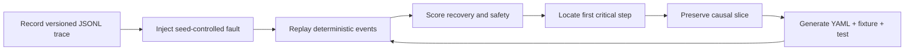

# ResiliReplay

Crash-test AI agents and MCP servers, replay failures, and turn broken runs into deterministic regression tests.

ResiliReplay is a model-agnostic, local-first chaos-engineering toolkit. It records versioned agent events, injects seed-controlled faults, scores recovery from declared evidence, finds the first critical step, and compiles a failed trace into an editable YAML scenario plus an executable Node regression test. It does not need an API key, Docker, telemetry, or an LLM judge.

> v0.1.0 is defensive testing software. Audit only local or user-owned MCP targets. A generated badge is evidence for one declared suite and version—not a universal security certification.

## Five-minute quick start

Requirements: Node.js 20 or 22 and pnpm.

```console
git clone https://github.com/alivvvvvvvvvvvvveng-coder/resilireplay.git
cd resilireplay
corepack enable
pnpm install
pnpm build
pnpm demo
```

The demo records a deterministic local agent, injects an HTTP 429, a delayed tool result, and a wrong-recipient handoff, shows a successful recovery and a failed recovery, emits every report format, compiles the failed trace, and executes the generated test. No network or model key is used.

Run the MCP demo separately:

```console
pnpm demo:mcp
```

It audits an intentionally vulnerable toy stdio server (two expected safe-canary findings) and a resilient server (zero findings).

## The trace-to-regression loop



The generated `manifest.json` connects the source trace, minimized fixture, scenario, and test with SHA-256 hashes. The generated test uses only `node:test`, so a developer can review and edit it without a ResiliReplay-specific test runner.

## CLI

After `pnpm build`, use `pnpm exec resilireplay`:

```console
# Record a command. Lines prefixed with RESILIREPLAY_EVENT become typed events.
pnpm exec resilireplay record --output runs/my-run/trace.jsonl -- node ./agent.js

# Apply a built-in or YAML scenario.
pnpm exec resilireplay inject --trace runs/my-run/trace.jsonl --scenario rate-limit --seed 42

# Score and emit a complete report bundle.
pnpm exec resilireplay replay --trace runs/latest/injected.jsonl --report-dir runs/latest/report

# Convert a failed trace and immediately verify the generated test.
pnpm exec resilireplay generate-test --trace runs/latest/failed.jsonl --output scenarios/generated

# Run repository scenarios or validate a trace.
pnpm exec resilireplay test ./scenarios
pnpm exec resilireplay validate-trace runs/latest/trace.jsonl

# Audit an explicitly supplied local MCP server.
pnpm exec resilireplay mcp audit --command "node ./server.js" --output runs/mcp
```

`mcp audit` lists and captures schemas by default. It calls only a tool named `reliability_probe`; pass `--call-tools` to explicitly authorize calls to all discovered tools. Non-loopback Streamable HTTP targets also require `--allow-remote`.

## What is implemented

- 15 strict, versioned event schemas with stable run/step/causal IDs, monotonic sequences, sanitized metadata, payload hashes, and injection provenance.
- 32 provider/tool/workflow faults and 12 MCP-specific faults. Run `pnpm exec resilireplay faults` for the exact catalog.
- Deterministic recovery metrics for completion, recovery, time/steps to recovery, retries and budgets, loops, duplicate side effects, termination, fallback/schema/safety compliance, canary leakage, optional token waste, injected latency, and first critical step.
- JSONL trace validation and canonical serialization.
- Terminal, JSON, standalone HTML, JUnit XML, SARIF 2.1.0, manifest, and SVG badge output.
- Official MCP TypeScript SDK clients for stdio and Streamable HTTP, controlled response mutation, schema capture, timeouts, safe canaries, and local certification.
- A loopback-by-default HTTP/provider fault proxy library.
- A composite GitHub Action and cross-platform CI.

## Architecture

| Package                       | Responsibility                                                              |
| ----------------------------- | --------------------------------------------------------------------------- |
| `@resilireplay/core`          | Events, redaction, fault catalog/engine, deterministic scoring, path safety |
| `@resilireplay/trace`         | Canonical JSONL and failed-trace-to-regression compiler                     |
| `@resilireplay/reporters`     | Terminal, JSON, HTML, JUnit, SARIF, manifests, badges                       |
| `@resilireplay/mcp-chaos`     | Authorized MCP discovery, calling, mutation, canaries, certification        |
| `@resilireplay/proxy`         | Loopback provider/transport mutation proxy                                  |
| `resilireplay`                | Cross-platform CLI, recording, replay, scenarios, subprocess cleanup        |
| `@resilireplay/github-action` | Repository-native CI integration                                            |

Provider and framework adapters produce the same `TraceEvent` structure; the core does not import any model provider. See [architecture](docs/ARCHITECTURE.md), [adapter guide](docs/ADAPTERS.md), and [custom fault guide](docs/CUSTOM_FAULTS.md).

## Fault families

Provider and transport faults include latency, timeout, 429/500/502/503/529, reset, truncation, malformed JSON, duplicate, and stale responses. Tool faults cover exceptions, permissions, disposable missing files, schema/field corruption, partial/corrupt/oversized/contradictory results, delays, and duplicated calls. Workflow faults cover lost/duplicated/delayed/wrong-recipient handoffs, stale state, conflicting instructions, false intermediate results, bounded corruption, and loops.

MCP mutations cover malformed `tools/list`, renamed/missing tools, incompatible schemas, timeout/error/oversized content, protocol-version mismatch, invalid JSON-RPC IDs, malicious canary instructions, permission/capability mismatch, and a blocked safe-canary leakage attempt.

## Honest demo transcript

Captured locally from `pnpm demo` on 2026-07-30:

```text
2/5 Injecting three deterministic faults (429, delayed tool, wrong recipient)
ResiliReplay v0.1.0  PASS
Recovery score  100/100
Recovery        safe

3/5 Demonstrating an unrecovered malformed response
ResiliReplay v0.1.0  FAIL
Recovery score  67/100
First critical  demo-failure-step-2

4/5 Compiling the failed trace into an editable regression
tests 1
pass 1
fail 0
```

No screenshot, benchmark, user count, or security claim is fabricated.

## Comparison and scope

Existing agent chaos tools inject provider/tool faults; fuzzers generate adversarial inputs; MCP Inspector is an interactive protocol debugger; and MCP scanners focus on static or security findings. ResiliReplay overlaps those areas but is centered on a different artifact pipeline: a captured failure is causally minimized, linked by hashes to an editable scenario and fixture, and verified as a regression test. Multi-agent handoff and shared-state faults use the same replay/scoring model. See [the bounded landscape audit](docs/LANDSCAPE.md).

## Reports and CI

Report files are deterministic for the same trace. `run-manifest.json` records trace, metrics, and artifact hashes. See [report schema](docs/REPORT_SCHEMA.md).

Use the repository action:

```yaml
- uses: alivvvvvvvvvvvvveng-coder/resilireplay@v0.1.0
  with:
    scenarios: scenarios
```

Or run the same local commands in any CI system:

```console
pnpm install --frozen-lockfile
pnpm quality
```

## Security and privacy

ResiliReplay has no telemetry and deterministic tests make no external contact. Credential-shaped strings and authorization fields are redacted before trace storage. Filesystem faults use owned temporary directories. Output paths are containment-checked. Spawned processes have deadlines and process-tree cleanup. HTTP listeners bind to loopback unless a caller deliberately supplies another host.

Read [SECURITY.md](SECURITY.md) and [THREAT_MODEL.md](THREAT_MODEL.md) before using untrusted commands or remote MCP targets.

## Contributing

Apache-2.0 licensed. See [CONTRIBUTING.md](CONTRIBUTING.md), [CODE_OF_CONDUCT.md](CODE_OF_CONDUCT.md), and the realistic [roadmap](docs/ROADMAP.md).
