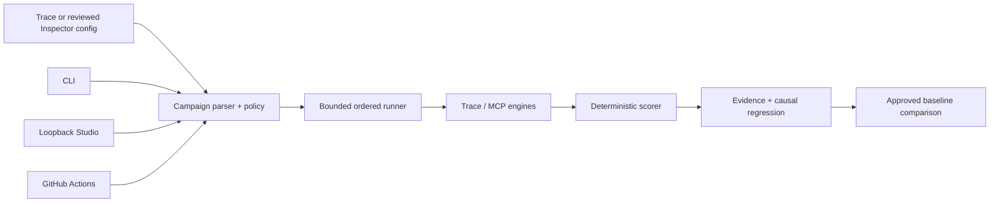

# Architecture

ResiliReplay is one TypeScript product with three interfaces over one deterministic engine: the CLI,
the loopback Studio, and CI. Its stable boundary is the versioned, provider-neutral `TraceEvent`, not
a model SDK.

## Packages and dependency direction

`core` is the leaf library. `trace`, `reporters`, and `proxy` depend on core. `mcp-chaos` depends on
core, reporters, and the official MCP SDK. `campaign` composes core, trace, reporters, and mcp-chaos.
`studio` is a narrow HTTP/HTML adapter over campaign. `cli` bundles the product-facing packages into
the published `resilireplay` executable. The GitHub Action invokes that same CLI.

No UI-only fault engine or scoring path exists. Studio submits a repository-contained campaign or a
reviewed Inspector-shaped target to the shared APIs and consumes persisted run evidence.

## Persisted contracts

- `TraceEvent` remains schema `1.0`: one run ID, unique step IDs, strictly increasing sequences,
  sanitized metadata/payloads, and a SHA-256 payload hash.
- Campaign, campaign-run, baseline, and comparison documents use schema `1.0` plus fixed `kind`
  discriminators. Readers reject unknown fields and unsupported versions.
- Injection is a pure transformation of trace + scenario + seed. Provenance retains the original
  payload hash.
- Run and comparison hashes cover canonical sanitized content. Random run IDs and timestamps are not
  described as deterministic.
- Missing adapter evidence is represented as `null`/unavailable, never guessed.

## Campaign execution

Validation resolves all target/scenario references before execution. Scenario scheduling is bounded
by `budgets.concurrency`; output order is the declared order, independent of completion timing.
Every scenario has a deadline, the campaign has a total deadline, and an abort signal propagates to
MCP calls and child cleanup. Tool-calling campaigns are deliberately not resumable.

MCP campaigns import one named entry from a reviewed Inspector-shaped configuration. Discovery is
read-only. Calling requires a non-empty tool allowlist and a confirmation of the exact canonical
campaign hash. The runner sends a command and argument array directly with `shell: false`.

Each scenario persists a trace, deterministic metrics where supported, assertions, report paths,
and causal-regression status. Failed scenarios compile the first causal failure to an editable
scenario, minimized JSONL fixture, manifest, and executable `node:test`, then execute it before
claiming generation succeeded.

## Baselines and comparisons

Only a complete run whose declared expectations all pass can become a baseline. Comparison verifies
schema, kind, integrity hash, campaign identity, scenario identity/order, and completeness before
evaluating thresholds. Invalid, cancelled, incomplete, or mismatched evidence cannot compare as
passing.

Comparisons cover deterministic score, retries, duplicate side effects, safety, and completion.
Latency, tokens, and cost are compared only when both sides contain actual adapter evidence.

## Studio boundary

Studio binds only to `127.0.0.1` and chooses an ephemeral port by default. The bootstrap response sets
an in-memory HttpOnly SameSite cookie and exposes a separate CSRF token to the same-origin page.
State requests require exact Host, allowed Origin, the cookie, JSON content type, a matching CSRF
header, and a bounded body. Static assets are embedded and covered by a restrictive CSP.

The browser can select repository-contained config/campaign files but cannot submit arbitrary shell
text. Downloads are chosen from a server-maintained evidence allowlist and pass lexical plus realpath
containment checks. Shutdown aborts active runs, closes transports/processes, clears sessions, and
awaits listener closure.

## Compatibility and versioning

Existing trace, replay, report, test-generation, and direct MCP audit commands remain compatible.
Changing required persisted fields, semantics, or report meaning requires a schema-version change and
migration notes. v0.3.0 adds schemas; it does not mutate the existing `TraceEvent` schema.
