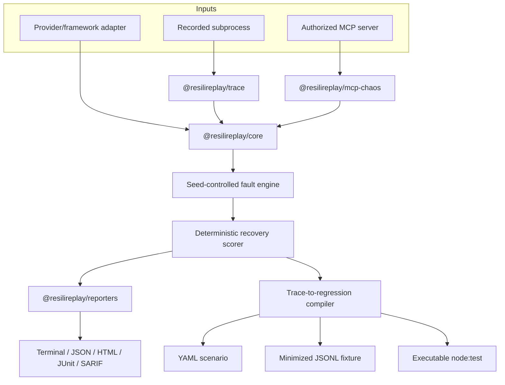

# Architecture

ResiliReplay is one TypeScript monorepo and one product. Its stable boundary is the versioned `TraceEvent`, not a provider SDK.

## Invariants

- Events use schema version `1.0`, one run ID, unique step IDs, strictly increasing sequences, sanitized metadata, and a SHA-256 payload hash.
- Injection is a pure transformation of a trace plus scenario plus seed. Injection provenance preserves the original payload hash.
- Primary scoring never calls an LLM. It uses typed events, declared validations, safety events, and test oracles.
- The compiler chooses the first unrecovered fault or explicit critical event, walks parent/cause dependencies, keeps relevant recovery and terminal evidence, and hashes every generated artifact.
- MCP targets must be explicit. Remote HTTP needs an additional ownership acknowledgement.
- The CLI never invokes a shell for `record`; executable and arguments are passed separately.

## Package dependencies

`core` is the leaf library. `trace`, `reporters`, and `proxy` depend only on core. `mcp-chaos` depends on core, reporters, and the official MCP SDK. `cli` integrates those packages. The GitHub Action calls the same scenario runner as local use.

## Versioning

Changing required event fields, semantics, scenario structure, or report fields requires a schema-version change and migration notes. Readers reject payload hash mismatches rather than silently accepting corrupted evidence.
