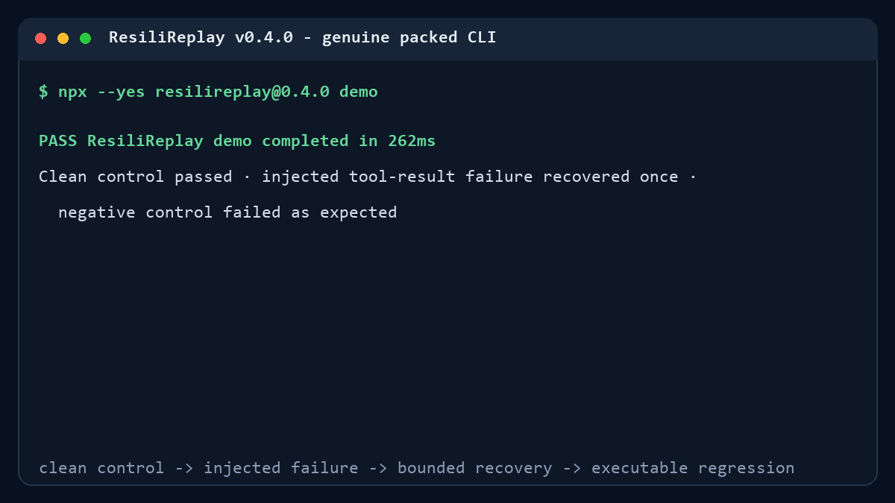
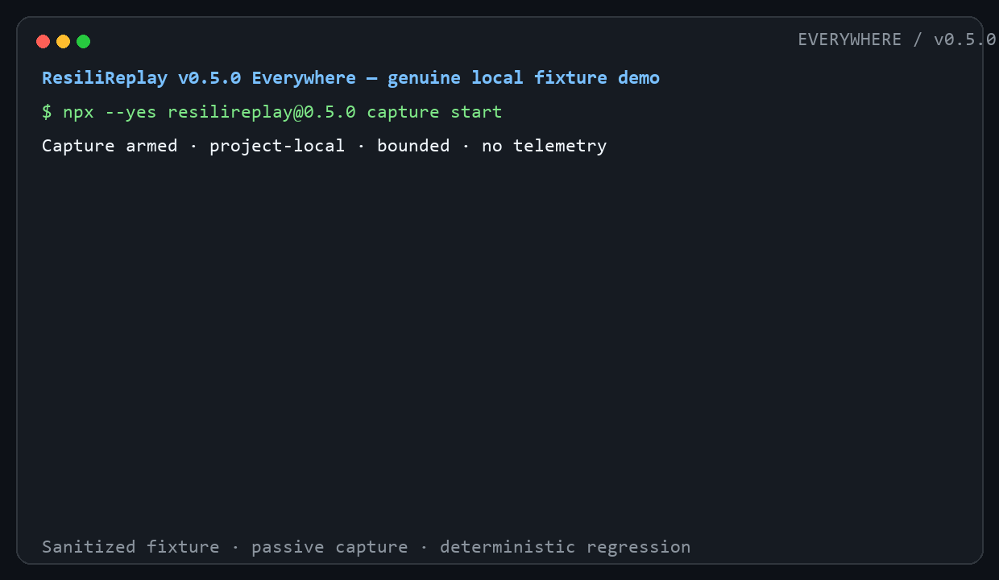

# Verified demos

ResiliReplay demos execute repository-owned local fixtures. They use no API key, paid model, external
account, telemetry, or prerecorded pass result. Fixture output is not presented as a live provider.

## Zero-configuration v0.5 demo

From an empty directory:

```console
npx --yes resilireplay@0.5.0 demo
```

The packaged deterministic fixture runs a clean control, injects one MCP-shaped tool-result error,
recovers with one bounded retry, verifies an expected malicious-canary negative control, generates an
executable regression, and executes that regression. Without `--output`, its temporary workspace is
removed. The same seed produces the same canonical evidence hash.

The public GIF, static fallback, and transcript are generated from the packed v0.5.0 package rather
than typed output:



[Static fallback](assets/adopt-demo.png) - [captured transcript](assets/adopt-demo-transcript.txt)

See [ADOPT.md](ADOPT.md) for the next step against an existing MCP configuration.

## Everywhere: passive agent capture

```console
npx --yes resilireplay@0.5.0 connect --agent auto --dry-run
npx --yes resilireplay@0.5.0 capture start
pnpm demo:agent
```

The Everywhere demo runs a real repository-owned command that exits 7, passes the documented hook
payload through the bundled normalization/capture path, displays bounded evidence, generates an
executable regression, and runs that regression successfully. It performs no automatic retry and
uses no model credential.



[Static fallback](assets/everywhere-demo.png) - [captured transcript](assets/everywhere-demo-transcript.txt)

## Studio & Campaigns

From a fresh clone:

```console
pnpm install --frozen-lockfile
pnpm build
pnpm demo:studio
pnpm exec resilireplay studio --open
```

`pnpm demo:studio`:

1. imports the reviewed Inspector-shaped stdio config;
2. runs resilient/vulnerable negative controls and deterministic recovery/failure scenarios;
3. approves and compares a versioned baseline;
4. executes generated causal regression tests;
5. starts a real authenticated Streamable HTTP fixture and verifies a bounded retry;
6. verifies Studio startup and graceful listener shutdown; and
7. records the measured wall time and privacy disclosures.

Evidence is written below `.artifacts/studio-demo/`; the path is ignored because it contains local run
state. The sanitized, path-free transcript is committed at
[`docs/assets/studio-demo-transcript.txt`](assets/studio-demo-transcript.txt).


Animated walkthrough: [Studio campaign GIF](assets/studio-campaign.gif).

Regenerate the browser captures after building:

```console
pnpm capture:studio
python scripts/generate-studio-gif.py
```

The capture script drives the real Studio with Playwright through review, confirmation, a complete
campaign, causal timeline, baseline comparison, and evidence downloads. The GIF generator only
assembles those verified frames.

## Original deterministic trace and Inspector demos

```console
pnpm demo
pnpm demo:mcp
pnpm exec resilireplay test scenarios
```

`pnpm demo` records the deterministic agent, injects three faults, scores recovered and unrecovered
runs, compiles a causal regression, and executes it. `pnpm demo:mcp` covers reviewed stdio config,
resilient/vulnerable servers, bounded recovery, unsafe-content detection, an authenticated real
Streamable HTTP fixture, and artifact hashes.

Their captured transcripts and launch assets remain in `docs/assets/`. All generated HTML reports are
standalone and load no remote assets.

## Release/stress reproduction

```console
pnpm test:e2e
pnpm release:gates
```

The browser gate exercises keyboard navigation and axe-core WCAG A/AA serious/critical checks. The
release gate performs 100 Studio start/stop cycles, a 20,000-event trace round trip, the real campaign,
the sub-60-second workflow assertion, and package-size measurement. Machine-readable measurements are
written to `.artifacts/release-gates/report.json`.
