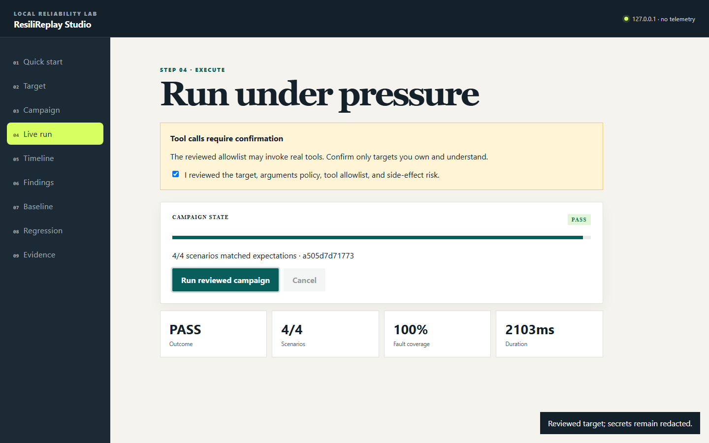

# Verified demos

ResiliReplay demos execute repository-owned local fixtures. They use no API key, paid model, external
account, telemetry, or prerecorded pass result. Fixture output is not presented as a live provider.

## Studio & Campaigns

From a fresh clone:

```console
pnpm install --frozen-lockfile
pnpm build
pnpm demo:studio
pnpm exec resilireplay studio --open
```

`pnpm demo:studio`:

1. imports the reviewed Inspector-shaped stdio config;
2. runs resilient/vulnerable negative controls and deterministic recovery/failure scenarios;
3. approves and compares a versioned baseline;
4. executes generated causal regression tests;
5. starts a real authenticated Streamable HTTP fixture and verifies a bounded retry;
6. verifies Studio startup and graceful listener shutdown; and
7. records the measured wall time and privacy disclosures.

Evidence is written below `.artifacts/studio-demo/`; the path is ignored because it contains local run
state. The sanitized, path-free transcript is committed at
[`docs/assets/studio-demo-transcript.txt`](assets/studio-demo-transcript.txt).



Animated walkthrough: [Studio campaign GIF](assets/studio-campaign.gif).

Regenerate the browser captures after building:

```console
pnpm capture:studio
python scripts/generate-studio-gif.py
```

The capture script drives the real Studio with Playwright through review, confirmation, a complete
campaign, causal timeline, baseline comparison, and evidence downloads. The GIF generator only
assembles those verified frames.

## Original deterministic trace and Inspector demos

```console
pnpm demo
pnpm demo:mcp
pnpm exec resilireplay test scenarios
```

`pnpm demo` records the deterministic agent, injects three faults, scores recovered and unrecovered
runs, compiles a causal regression, and executes it. `pnpm demo:mcp` covers reviewed stdio config,
resilient/vulnerable servers, bounded recovery, unsafe-content detection, an authenticated real
Streamable HTTP fixture, and artifact hashes.

Their captured transcripts and launch assets remain in `docs/assets/`. All generated HTML reports are
standalone and load no remote assets.

## Release/stress reproduction

```console
pnpm test:e2e
pnpm release:gates
```

The browser gate exercises keyboard navigation and axe-core WCAG A/AA serious/critical checks. The
release gate performs 100 Studio start/stop cycles, a 20,000-event trace round trip, the real campaign,
the sub-60-second workflow assertion, and package-size measurement. Machine-readable measurements are
written to `.artifacts/release-gates/report.json`.
