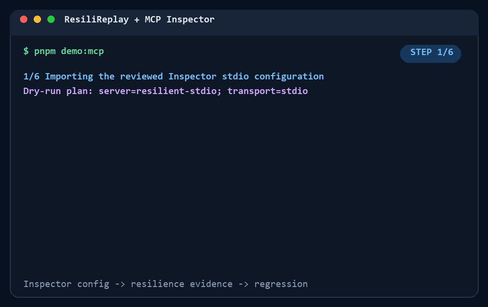

# MCP Inspector configuration integration

ResiliReplay is compatible with reviewed MCP Inspector `mcp.json` exports. MCP Inspector is the
interactive tool for testing and debugging a server; ResiliReplay reuses that reviewed connection
definition to introduce controlled failures, score recovery, preserve replay evidence, and generate
an executable regression. The projects are complementary. Compatibility does not imply an official
partnership, endorsement, or certification.

This integration was audited against MCP Inspector `2.0.0` at commit
`7aebf168e6277ea26b1f04a7987a1cd11328ec83` and MCP protocol revision `2026-07-28`.

## Quick start

Given an Inspector file with one entry:

```json
{
  "mcpServers": {
    "my-server": {
      "type": "stdio",
      "command": "node",
      "args": ["build/index.js"]
    }
  }
}
```

Inspect the value-free execution plan first:

```console
pnpm exec resilireplay mcp audit \
  --inspector-config ./mcp.json \
  --dry-run
```

Then run the audit:

```console
pnpm exec resilireplay mcp audit \
  --inspector-config ./mcp.json \
  --output runs/mcp-inspector
```

When `mcpServers` contains more than one entry, selection is explicit:

```console
pnpm exec resilireplay mcp audit \
  --inspector-config ./mcp.json \
  --server my-server \
  --output runs/mcp-inspector
```

The importer never writes or migrates the Inspector file. Exactly one entry is auto-selected; two
or more entries require `--server`, matching the Inspector CLI's unambiguous selection behavior.

## Stdio

Stdio commands are spawned directly with an executable and argument array. ResiliReplay never
concatenates imported values into a shell command. Argument boundaries are preserved, including
paths and arguments containing spaces. Relative executable and script paths resolve from the
configuration file's directory and must remain inside the repository root selected by the CLI.

```console
pnpm exec resilireplay mcp audit \
  --inspector-config tests/fixtures/mcp-inspector/stdio-single.json \
  --fault mcp-tool-error \
  --recovery retry \
  --output runs/mcp-inspector/recovered
```

The bounded retry is genuine: after the deterministic first-result mutation, ResiliReplay calls the
same reviewed `reliability_probe` once more, records the retry and recovery action, and scores the
result. Other tools remain uncalled unless `--call-tools` is explicitly supplied.

## Streamable HTTP

Inspector v2 documents `type: "http"`; stored catalogs can also contain the normalized
`type: "streamable-http"`. ResiliReplay accepts both. The endpoint must use HTTP(S), URL credentials
are rejected, and targets outside `localhost`, `127.0.0.1`, or `[::1]` require `--allow-remote` as an
explicit authorization statement.

```json
{
  "mcpServers": {
    "my-http-server": {
      "type": "http",
      "url": "http://127.0.0.1:3000/mcp",
      "headers": {
        "Authorization": "${env:MCP_SERVER_AUTHORIZATION}"
      },
      "connectionTimeout": 5000,
      "requestTimeout": 5000
    }
  }
}
```

`${env:NAME}` is a narrow ResiliReplay reference syntax accepted wherever an imported environment
or header value is a string. It reads exactly one process environment variable. `$NAME`, `%NAME%`,
command substitutions, backticks, pipes, semicolons, and other shell expressions are never
expanded. Inspector's ordinary string values remain literals.

Legacy `type: "sse"` entries are accepted for backwards compatibility because Inspector 2.0.0 still
supports them, although Streamable HTTP is the current standard transport.

## Secrets and execution plans

Imported environment and header values exist only in the connection setup held in memory. They are
never included in a trace, report, certification, manifest, console plan, or generated regression.
Dry-run output contains names, `literal` versus `variable-reference` source labels, and
`[REDACTED]` in place of every value. Authentication headers are sent to the configured HTTP server
but never persisted.

ResiliReplay additionally:

- rejects credentials in URLs and credential-shaped query parameters;
- rejects CR/LF header injection and transport-controlled headers;
- rejects `DANGEROUSLY_OMIT_AUTH` and Inspector proxy session-token declarations;
- redacts sensitive object keys, bearer/basic values, common provider tokens, URL-encoded tokens,
  and explicitly base64-labelled values before persistence;
- turns credential-shaped server output into finding `MCP007` and exit code `13` without retaining
  the original value.

Pattern redaction is defense in depth, not a substitute for keeping production secrets out of test
servers and fixtures.

## Evidence and regression

A non-dry audit writes `trace.jsonl`, certification JSON/HTML, a scope-limited badge, terminal/JSON/
HTML/JUnit/SARIF reports, and hash manifests below `--output`. To turn an expected failed audit into
an executable regression:

```console
pnpm exec resilireplay generate-test \
  --trace runs/mcp-inspector/trace.jsonl \
  --output runs/mcp-inspector/regression
```

The generated `node:test` executes by default. `pnpm demo:mcp` demonstrates the complete Inspector
config -> stdio/HTTP connection -> controlled fault -> recovery/failure -> causal minimization ->
executed regression path and records source/config/scenario/fixture/test SHA-256 values.



Static fallback: [MCP Inspector integration demo image](assets/mcp-inspector-demo.png).

## Exit codes

| Code | Meaning                                                                              |
| ---: | ------------------------------------------------------------------------------------ |
|  `0` | Dry-run or audit completed without findings; injected fault recovered when requested |
|  `1` | Reliability or safety findings, including an expected unrecovered injected fault     |
|  `2` | CLI parser/usage failure                                                             |
| `10` | Missing, invalid, ambiguous, conflicting, unsupported, or escaping configuration     |
| `11` | Non-loopback target lacks explicit `--allow-remote` authorization                    |
| `12` | Process startup, connection, timeout, transport, or malformed MCP response failure   |
| `13` | Credential-shaped MCP output was detected and redacted                               |

## Troubleshooting

- **Multiple servers require `--server`:** copy a name exactly from `mcpServers` and pass it with
  `--server`.
- **A script cannot be found:** paths are relative to `mcp.json`, not the invoking shell. Keep the
  referenced path inside the repository and inspect `--dry-run`.
- **A variable reference is not defined:** export the named variable in the environment that starts
  ResiliReplay. The error prints the variable name, never a value.
- **Remote authorization is rejected:** use `--allow-remote` only after confirming the endpoint is
  owned by you or you have permission to audit it.
- **`protocolEra: "modern"` is rejected:** ResiliReplay 0.2.0 uses the stable MCP SDK 1.30 client and
  audits Inspector's default legacy era. Modern 2026-07-28 wire-era negotiation is not yet supported.
- **OAuth or other Inspector-only settings are rejected:** no field with execution impact is silently
  ignored. Use an already authorized static header for a controlled test server, or audit with
  Inspector until the required authentication flow is supported here.

See the [field-by-field compatibility matrix](MCP_INSPECTOR_COMPATIBILITY.md),
[security policy](../SECURITY.md), and [threat model](../THREAT_MODEL.md).
