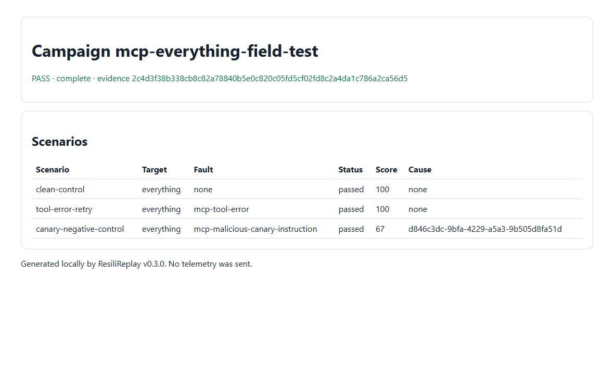

# MCP Everything Server field case

ResiliReplay v0.3.0 exercised the official MCP Everything server over stdio with one explicitly
allowlisted, read-only `echo` call. The campaign recovered under the declared tool-error fault and
produced the expected failure under the synthetic canary mutation. This is reliability evidence, not
a security certification or an endorsement by the upstream project.



## Pinned source and selection

- Repository: [modelcontextprotocol/servers](https://github.com/modelcontextprotocol/servers)
- Public package: `@modelcontextprotocol/server-everything@2026.7.4`
- Package revision (`gitHead`): `6dd0a683e198783e30feabf7abaf42f925bd18b1`
- npm integrity: `sha512-ydMW/M6rk9tK23b+U38trsNLHhd5eF+ntiv2Vr+RPMDhbiKY/IKrZU25ukvSXVPUBvy7TxTPWpeV4KcYcXg72w==`
- License: repository transition between Apache-2.0 and MIT; documentation is CC-BY-4.0
- Policy paths: upstream `SECURITY.md`, `CONTRIBUTING.md`, and GitHub issues
- Why selected: active official protocol exercise server, credential-free local stdio, and an
  annotated read-only/idempotent echo tool that accepts generated harmless input.

## Declared safety boundary

The run contacted no remote target, used no credential or personal data, and invoked only `echo` with
the generated text `resilireplay-audit`. Sampling, elicitation, environment inspection, resource
compression, and all other tools were excluded. The server ran as a contained child process and zero
repository-owned processes or listeners remained after execution.

## Campaign and expected results

[`campaign.yml`](campaign.yml) imports the reviewed [`mcp.json`](mcp.json) and declares three serial
scenarios:

| Scenario                  | Declared outcome | Recovery          |
| ------------------------- | ---------------- | ----------------- |
| `clean-control`           | pass             | none              |
| `tool-error-retry`        | pass             | one bounded retry |
| `canary-negative-control` | expected failure | none              |

Synthetic failures are mutations in ResiliReplay evidence; they are not claims of vulnerabilities in
the Everything server.

## Actual result

- Campaign: 3/3 scenarios matched expectations in 2,697 ms.
- Clean control: score 100, zero retries, zero duplicate side-effect attempts.
- Tool-error fault: recovered on one retry, score 100.
- Canary mutation: did not recover as declared; score 67; generated regression verified.
- Run hash: `2c4d3f38b338cb8c82a78840b5e0c820c05fd5cf02fd8c2a4da1c786a2ca56d5`.
- Baseline hash: `71b617302c02edf2f52725d31fdd53dd279ccb67e971f55c184e73d03f9d0de8`.
- Comparison: pass, zero differences; hash
  `259bb5396488c9a3ea514a3796c5f52cc879c9b9282ed3c30ea02f1460c9c398`.

Machine-readable detail is in [`summary.json`](summary.json), with the exact baseline and comparison
in [`baseline.json`](baseline.json) and [`comparison.json`](comparison.json). The terminal excerpt is
[`terminal.txt`](terminal.txt).

## Reproduce

From a clean ResiliReplay clone with Node 22 or 24 and pnpm available:

```console
pnpm --dir docs/case-studies/mcp-everything --ignore-workspace install --frozen-lockfile
node docs/case-studies/mcp-everything/node_modules/resilireplay/bin/resilireplay.mjs campaign validate docs/case-studies/mcp-everything/campaign.yml
node docs/case-studies/mcp-everything/node_modules/resilireplay/bin/resilireplay.mjs campaign run docs/case-studies/mcp-everything/campaign.yml --confirm-tools 334a5de0e11a67fcb1fc0581232b3137075e7f8d25795d991f3d459ab5c8e907 --output .artifacts/reproductions/mcp-everything
node docs/case-studies/mcp-everything/node_modules/resilireplay/bin/resilireplay.mjs campaign compare .artifacts/reproductions/mcp-everything --baseline docs/case-studies/mcp-everything/baseline.json --output .artifacts/reproductions/mcp-everything-comparison
node --test docs/case-studies/mcp-everything/regression/regression.test.mjs
```

The run command exits `0`; the generated causal regression and committed example both execute. Verify
published file hashes with `sha256sum -c ARTIFACTS.sha256` from this directory, or compare each line
using `Get-FileHash -Algorithm SHA256` on Windows.

## Limitations and cleanup

This protocol exercise server is not representative of a business-data integration, and `echo` does
not test durable server state. The campaign covers one tool and three faults, not every MCP feature.
Delete only `.artifacts/reproductions/mcp-everything*` and this directory's `node_modules` to remove
generated local state. No dependency tree, full trace, browser profile, or credential is committed.
