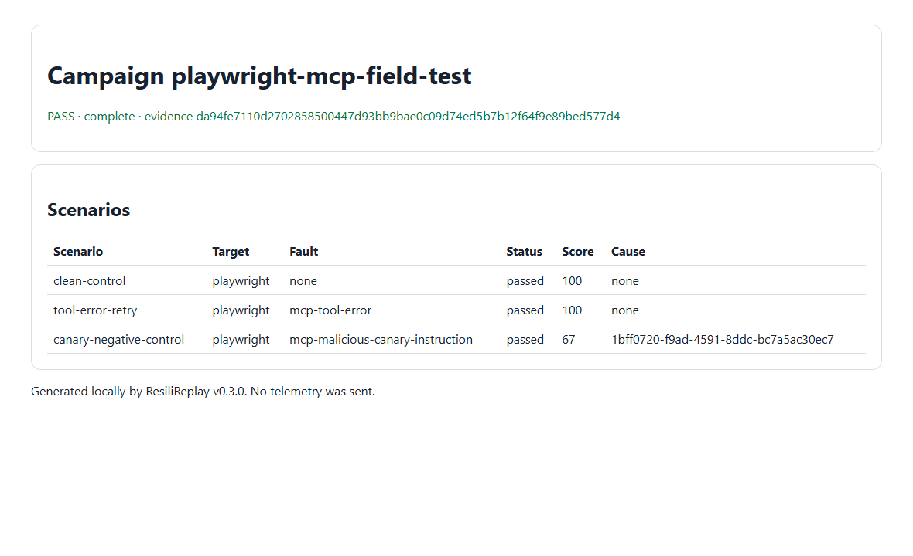

# Playwright MCP field case

ResiliReplay v0.3.0 exercised Microsoft Playwright MCP over stdio in a headless, isolated browser
session. The campaign invoked only the read-only `browser_snapshot` tool on the default blank page,
recovered under a bounded tool-error fault, and generated a regression for an expected synthetic
failure. This is reliability evidence, not a security certification or an upstream endorsement.



## Pinned source and selection

- Repository: [microsoft/playwright-mcp](https://github.com/microsoft/playwright-mcp)
- Public package: `@playwright/mcp@0.0.78`
- Package revision (`gitHead`): `5f8fc00210b27b4407c375b59cda4838045d429c`
- npm integrity: `sha512-XLTUeA6mEN9sQ+hJ4dfG8EIkDbxS0K3Trc2RBkUJuf02TgE2FQRNTMtq/aJfhyRMINsRl/Ybc4sxcWLtFn4/TQ==`
- License: Apache-2.0
- Policy paths: upstream `SECURITY.md`, `CONTRIBUTING.md`, and GitHub issues
- Why selected: active independent server, credential-free local browser automation, documented
  stdio transport, and a read-only accessibility snapshot tool.

## Declared safety boundary

The browser was headless, isolated, service workers were blocked, and its exact Chrome-for-Testing
binary lived below this case directory. The run did not navigate, contact a remote page, read files,
reuse a browser profile, or invoke clicks, scripts, uploads, storage, screenshots, or unsafe code.
Only `browser_snapshot` was allowed. Zero repository-owned processes or listeners remained.

## Campaign and expected results

[`campaign.yml`](campaign.yml) imports the reviewed [`mcp.json`](mcp.json) and declares a clean
snapshot, a synthetic tool error followed by one retry, and an expected canary failure. The campaign
hash is `7473e2206608c81521c91866b0cecd29e70c9630ad9b83a56f7d04bd9fdde0b5`.

## Actual result

- Campaign: 3/3 scenarios matched expectations in 4,790 ms.
- Clean control: real blank-page accessibility snapshot, score 100.
- Tool-error fault: recovered on one retry, score 100, no duplicate side-effect attempt.
- Canary mutation: did not recover as declared; score 67; generated regression verified.
- Run hash: `da94fe7110d2702858500447d93bb9bae0c09d74ed5b7b12f64f9e89bed577d4`.
- Baseline hash: `703eaa0c94ea0fab6172dfe0ff9df2ded59894e0d523c38c963b6f569d286a31`.
- Comparison: pass, zero differences; hash
  `13eae0c2d9a91bfd66f26e8842dcdadaa0cc40725491bcf055cd1a8b84b9eb2f`.

The first pre-install attempt is deliberately not counted as a pass: the server returned
`isError=true` because Chrome for Testing was absent. After the documented browser install, the same
campaign completed. See [`summary.json`](summary.json), [`terminal.txt`](terminal.txt), and the
generated [`regression`](regression/) example.

## Reproduce

From a clean clone with Node 22 or 24 and pnpm:

```console
pnpm --dir docs/case-studies/playwright-mcp --ignore-workspace install --frozen-lockfile
PLAYWRIGHT_BROWSERS_PATH=docs/case-studies/playwright-mcp/browsers node docs/case-studies/playwright-mcp/node_modules/@playwright/mcp/cli.js install-browser chrome-for-testing
node docs/case-studies/playwright-mcp/node_modules/resilireplay/bin/resilireplay.mjs campaign validate docs/case-studies/playwright-mcp/campaign.yml
node docs/case-studies/playwright-mcp/node_modules/resilireplay/bin/resilireplay.mjs campaign run docs/case-studies/playwright-mcp/campaign.yml --confirm-tools 7473e2206608c81521c91866b0cecd29e70c9630ad9b83a56f7d04bd9fdde0b5 --output .artifacts/reproductions/playwright-mcp
node docs/case-studies/playwright-mcp/node_modules/resilireplay/bin/resilireplay.mjs campaign compare .artifacts/reproductions/playwright-mcp --baseline docs/case-studies/playwright-mcp/baseline.json --output .artifacts/reproductions/playwright-mcp-comparison
node --test docs/case-studies/playwright-mcp/regression/regression.test.mjs
```

In PowerShell, set the browser path first with
`$env:PLAYWRIGHT_BROWSERS_PATH='docs/case-studies/playwright-mcp/browsers'`, then run the installer.

## Limitations and cleanup

The clean operation observes a blank disposable page; navigation, authentication, web applications,
and browser actions are outside this campaign. The browser download is large. Remove only
`.artifacts/reproductions/playwright-mcp*`, this directory's `node_modules`, and its ignored `browsers`
directory to delete all generated state. Hashes are listed in [`ARTIFACTS.sha256`](ARTIFACTS.sha256).
