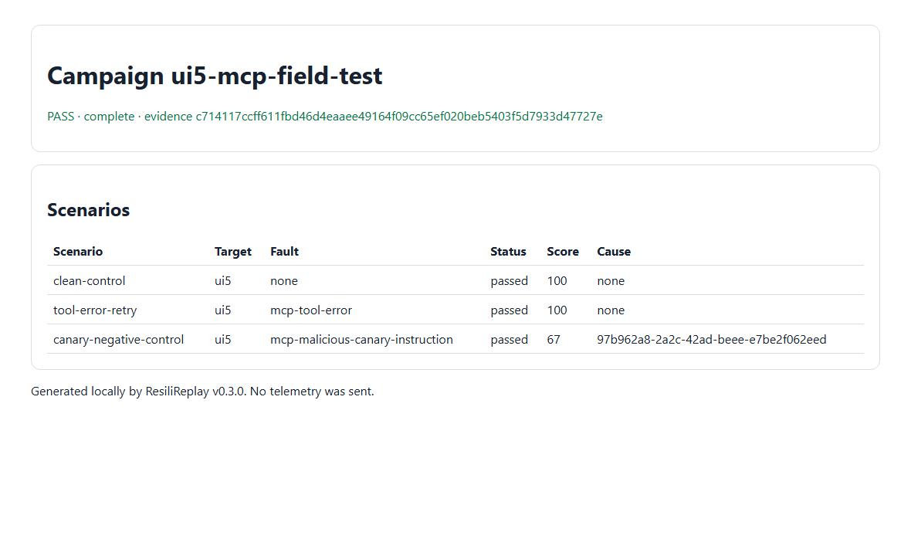

# UI5 MCP Server field case

ResiliReplay v0.3.0 exercised the UI5 MCP Server over local stdio using only its annotated read-only,
idempotent `get_guidelines` tool. The declared campaign recovered after a synthetic tool error and
preserved an expected canary failure as an executable regression. This is reliability evidence, not
a security certification or an upstream endorsement.



## Pinned source and selection

- Repository: [UI5/mcp-server](https://github.com/UI5/mcp-server)
- Public package: `@ui5/mcp-server@0.2.17`
- Package revision (`gitHead`): `46f3ede7a0fa8e3aed3d801b9c5a1e7f340d32ea`
- npm integrity: `sha512-Gssx1xzCAmuwhsEwmLJNuALqaFjYhN4BHALFVpZp8YOfcXQXXNmsZs8kM0DlM8Rm12vduHxj/4Ovb9QcjXoj1w==`
- License: Apache-2.0
- Policy paths: upstream `CONTRIBUTING.md` and GitHub issues; no repository `SECURITY.md` was found
  during selection.
- Why selected: active organization-maintained server, current public release, local credential-free
  stdio, and a bundled guidelines read operation with no project or customer data.

## Declared safety boundary

Only `get_guidelines` was allowlisted. The campaign did not inspect a UI5 project, run the linter,
create an application or card, write files, or call any production service. Input was empty and the
response was sanitized before persistence. Zero repository-owned child processes or listeners
remained after execution.

## Campaign and expected results

[`campaign.yml`](campaign.yml) imports [`mcp.json`](mcp.json) and declares a clean control, a bounded
tool-error retry, and an expected canary failure. Synthetic mutations are not upstream
vulnerabilities.

## Actual result

- Campaign: 3/3 scenarios matched expectations in 4,600 ms.
- Clean control: guidelines returned, score 100, zero retries.
- Tool-error fault: recovered on one retry, score 100, zero duplicate side-effect attempts.
- Canary mutation: did not recover as declared; score 67; generated regression verified.
- Run hash: `c714117ccff611fbd46d4eaaee49164f09cc65ef020beb5403f5d7933d47727e`.
- Baseline hash: `db4264ac28a34cd604fb9834501e5f0a8145f67aa378dc6174ba6d2615db02fd`.
- Comparison: pass, zero differences; hash
  `114833e2fdef8dee6b4277301283957c0d78b585fbbca0183be2c504866d80c1`.

See [`summary.json`](summary.json), [`baseline.json`](baseline.json), [`comparison.json`](comparison.json),
and the verified generated [`regression`](regression/) example.

## Reproduce

From a clean clone with Node 22 or 24 and pnpm:

```console
pnpm --dir docs/case-studies/ui5-mcp --ignore-workspace install --frozen-lockfile
node docs/case-studies/ui5-mcp/node_modules/resilireplay/bin/resilireplay.mjs campaign validate docs/case-studies/ui5-mcp/campaign.yml
node docs/case-studies/ui5-mcp/node_modules/resilireplay/bin/resilireplay.mjs campaign run docs/case-studies/ui5-mcp/campaign.yml --confirm-tools 360bcce3d129bbe3f3631980300929b35a86ba5a0772db3b1d2dab60db92136e --output .artifacts/reproductions/ui5-mcp
node docs/case-studies/ui5-mcp/node_modules/resilireplay/bin/resilireplay.mjs campaign compare .artifacts/reproductions/ui5-mcp --baseline docs/case-studies/ui5-mcp/baseline.json --output .artifacts/reproductions/ui5-mcp-comparison
node --test docs/case-studies/ui5-mcp/regression/regression.test.mjs
```

## Limitations and cleanup

This campaign covers one bundled-content tool; it does not test UI5 project analysis, linting,
generation, remote documentation freshness, or writable operations. Remove only
`.artifacts/reproductions/ui5-mcp*` and this directory's `node_modules` to delete generated state.
Verify the compact published artifacts with [`ARTIFACTS.sha256`](ARTIFACTS.sha256).
